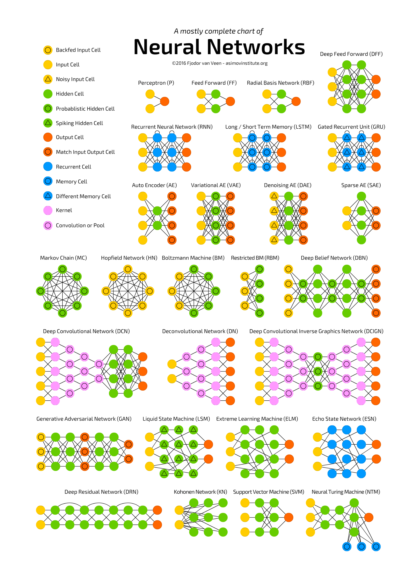

Machine learning algorithms :

    Supervised learning :   The model is trained on labeled datasets, meaning every input has a corresponding "correct answer".
                            The goal is to next send unlabelled data and make model guess the lable correctly .

        Regression :
            Linear regression 
            Logistic regression
        Classification :
            Decision tree
            Random forest : (Classification and regression)
                Combining many Decision trees together (Ensemble algorithm) will result random forest
                Bagging and Bootstrapping (Check later )
            Support vector machine
            K nearest neighbour (Can be regression or classification) :
                K is hyper parameter
                k=1 (overfitting)
                k= higher number (moving towards under fitting)
            Naive bayes

    Unsupervised learning : The AI analyzes unlabeled data without any guidance on what the output should be.
                            The goal of this model is to group data into meaningful sets .
        K means clustering :
            K is hyper parameter
        Heirarichal clustering
        DB scan
        Principal component analysis
        Guassian mix model
        Hidden markov process

    Reinforcement learning :    Think of a scenario where there is a clear task or goal , but there is infinite possibilities to acheive it.
                                For example a robot learning to walk . You design the model to try all the possibilities and only reward the 
                                model when it acheives progress in best way .
        Q learning
        Temporal learning
        Generative adversarial Networks

# All Neural Networks 

------------------------------------- PYTORCH -- START ------------------------------------------------------------

------------------------------------- PYTORCH -- END ------------------------------------------------------------

------------------------------------- CHECK LATER -- START ---------------------------------------------------------

AI SYSTEMS = 

RAG

VECTOR DATABASES

KOKORO TTS

Google AI STUDIO
    google generative ai

DEEPSEEK = Chineese Company which released open source "R1" model that rivals OPEN AI o1 reasoning model

LANGCHAIN =

PYDANTIC , AUTOGEN(microsoft) , LANGCHAIN , LANG GRAPH , CREWAI , SWARM = 

GPT , BERT , roBERTa =

EMBEDDING 
    Word Embeddings
        Word2Vec, GloVe, or FastText
    Contextual Embeddings
        BERT or GPT

RNN
LSTM

pip install 'accelerate>=0.26.0'   ------->>>> I tried using model(microsoft/phi-4) which seems big , it asked to do this

Boosting :
    XGBOOST
    ADABOOST
    Gradient Boost
------------------------------------- CHECK LATER -- End ------------------------------------------------------------
