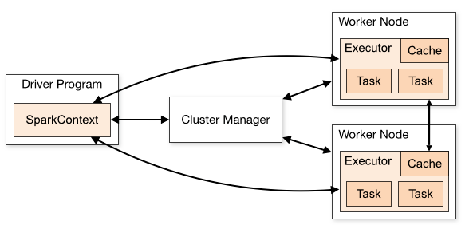

# Where does SPARK fit in HADOOP echo system
   1) SPARK is replacement of MAP REDUCE in hadoop echo system
   2) SPARK is faster than MAP REDUCE because , SPARK does "COMPLETE" in memory computation unlike 
      MAP REDUCE 
   3) MAP REDUCE too uses memory to do computation , But
      MAP REDUCE is designed to operate on (memory + hardisk) as its primary area to 
      store for computations
      That back and forth movement to storage is what makes MAP REDUCE slow.
   4) Spark also utilizes storage when computations , but only when its memory is full .
   5) Spark is designed to operate memory as its primary area to store for computations. 

# SPARK architechture

   1) Spark runs on MASTER SLAVE architechture
   2) These Master and slave nodes are not to be confused with HADOOP HDFS NAMENODE and DATANODE 
   3) Spark's  MASTER = DRIVER program
               SLAVE  = EXECUTOR program
      
      Both Driver and executor programs will run on Worker nodes in CLUSTER
   4) Cluster manager = An external service for acquiring resources on the cluster
      Based on what cluster manager is being used we can decide which mode our Spark cluster is deployed
      example = standalone manager, Mesos, YARN, Kubernetes
   5) Each "WORKER NODE" has one or more "EXECUTORS" and each executor will have one or more "SLOTS"
      One SLOT will be assigned one CPU

# SPARK code execution theory :
      1) Every SPARK command that you write will fall into one of two below mentioned categories
         - TRANSFORMATIONS 
               examples :  Any arithematic operations of column values.
                           Any selection of columns .
                           Any filtering of rows.
         - ACTIONS
               examples :  Any writing dataframe into a file .
                           "dataframe.collect()" will collect all the dataframe values and will 
                           bring them into driver node .
     
# PARTITIONING concept in SPARK

      1) SPARK PARTITIONING can be understood in two different ways :
            WAY 1 :
               DISK PARTITIONS:  These are the partitions in which HDFS(or any other storage protocal) 
                                 decides to store in the disk

               MEMORY PARTITIONS:   When Spark data reader reads data into memory , it forms patitions 
                                    in memory in its own way irrespective of how it was stored in DISK
            
            WAY 2 :
               INPUT PARTITIONING : Think of all the already partitioned data in HDFS as one single 
                                    data set.
                                    Spark data reader decides to read the DATASET while creating 
                                    the partitions in its own way into memory irrespective of how 
                                    it was partitioned in DISK

                                    While reading into memory , DEFAULT SIZE of single partiton is 
                                    128MB "spark.sql.files.maxPartitionBytes" this config can be set to 
                                    change the size from 128 MB

               OUTPUT PARTITIONING : While writing on to a disk , dataframe writer 

               SHUFFLE PARTITIONING :  After input partitioning is done , before doing any wide 
                                       transformations , 
                                       Spark SHUFFLES data among the "worker nodes memory" based on the 
                                       WIDE TRANSFORMATION condition

                                       "Spark.sql.shuffle.partitions" this SPARK config can be used to 
                                       set number of SHUFFLE partitions (default is 200)

# JOIN Startegies :

   1) Broadcast JOIN
   2) Broadcast Hash JOIN
   3) Shuffle hash JOIN
   4) Shuffle sort merge join
   5) Cartesian join

# Difference between COALESCE and REPARTITION :
      Feature     | coalesce(n)                                | repartition(n)
   🔄 Purpose     | Reduce number of partitions                | Increase or change number of partitions
   🔁 Shuffle     | ❌ No full shuffle (narrow transformation) | ✅ Full shuffle (wide transformation)
   ⚖️ Data Balance | Not evenly distributed                     | Evenly distributed across partitions
   🚀 Performance | Faster (no shuffle)                        | Slower (shuffles all data)
   🧠 Use Case    | Before writing to avoid small files        | For parallelism or after filtering
   📈 Example     | df.coalesce(4)                             | df.repartition(8)

-------------------------------------------------------------------------------------------------------------------------------------------------------------------------------------

check later --- start
Study about what happens in cache() and persist()
Dynamic partition pruning
Column Pruning

READ EXCHANGE, WRITE EXCHANGE IN SPARK UI

CATALYST OPTIMIZER
TUNGSTEN
AQE - ADAPTIVE QUERY EXECUTION
PLAN can be adaptive enough to change based on RUNTIME statistics

---- check later --- end -----------------------

SPARK is written in SCALA which uses JVM to create EXECUTION environment .

PYSPARK is a wrapper around JAVA API's of SPARK.

- Both "Driver Program" and "Executor Program" are run as JVM processes.
- When these are Run as JVM processes the memory structure starts off as below

-- Worker node
    |-- Executors : 1) spark.executor.cores
    |
    |-- VCPUs: One VCPU will be able to work on one task

    NOTE : 1) A "WORKER NODE" can have more than one "EXECUTOR PROGRAM"
           2) A "EXECUTOR PROGRAM" can have more than one "CPU CORE"
           3) A "CPU CORE" is responsible for running a task
              Number of CPU cores will decide how many TASKS can be run in PARALLEL
           VVIP) Whatever the values that we define in "spark.executor.memory" or any other such
              will be at EXECUTOR level, So if a Executor has more than one CPU, They will
              have to share these resources among the CPU CORES in an executors.

              So in interviews While calculating MEMORY AND CORE calculations,
              keep 1 core per executor for simplicity. later you can improve on it in practical scenario

-- Computer Memory
   |-- On Heap Memory : 1) spark.executor.memory -->> For executors
   |                  spark.driver.memory   -->> For driver
   |                  2) Used by JVM processes and GC(Garbage collector) handles this region .
   |                     primary location for dynamically allocating memory for java objects,
   |                     class instances, and arrays during program execution
   |                  3) spark.executor.memory shoud be > 1.5 * (Reserved Memory)
   |
   |-- Reserved Memory (System Memory) : 300 MB fixed for spark internals .
   |                                     Spark's internal objects and system-level operations which
   |                                     helps for spark to run itself .
   |
   |-- User Memory : 1) (40 % default) or ((Java Heap - Reserved Memory) * (1.0-Spark.memory.fraction))
   |                  2) User-defined data structures, variables, UDFs (User Defined Functions),
   |                     and RDD (Not the data but the Lazy evaluation operations) conversion operations .
   |                  3) Not managed by Spark's internal memory manager,
   |                     allocated and released based on the application's code
   |
   |-- Unified Spark Memory : 1) spark.memory.fraction = 0.6
   |                          2) 60 % memory Dynamically shared among below two
   |
   |-- Storage memory : 0) spark.memory.storageFraction = 0.5
   |                    1) 50 % of 60 % = 30 %.
   |                    2) "Cache of RDD's and DataFrames", unroll data, and broadcast variables
   |
   |-- Execution memory : 1) 50 % of 60 % = 30 %.
   |                      2) Used for temporary data during computation-intensive operations like
   |                         shuffles, joins, sorts, aggregations, and hash tables for hash aggregations
   |
   |-- Off Heap memory : 1) "spark.memory.offHeap.size" , "spark.memory.offHeap.size"
   |                    2) Memory outside the "JVM process and GC" control
   |                    3) Spark uses "Offheap" to store CACHE, BROADCAST and SERIALIZED data .
   |                    4) Data here will be in SERIALIZED way (subject to correction)
   |
   |-- Memory overhead : 1) For executor
   |                    spark.executor.memoryOverhead = max(384 MB, 10 % of spark.executor.memory)
   |                    2) For driver
   |                    spark.driver.memoryOverhead = max(384 MB , 10 % of spark.driver.memory)
   |
   |                    3) Used for running any SYSTEM DAEMONS or network buffer (subject to correction)

?) SPARK EXECUTOR PYSPARK MEMORY
------------------------- SER DE --START

1) Serialization is a software-level process to prepare complex data and convert into BYTE or JSON or XML format
   for storage or transmission or interoperability
2) Data stored directly as raw bytes (e.g., plain text or media files) may not require serialization .
3) The serialization process is performed by softwares such as programming language libraries,
   database management systems, or file format standards, not by the hard disk hardware.
   For example,
   When you save a document, the application formats and serializes the document's internal data structures
   into a file format before writing it as bytes on the disk.

Q1) Every data is a variation of either TEXT or MEDIA files.
    If they themselves aren't considered as complex for serialization,
    Then what exactly are those so called Complex data.

A1) Any data which requires to maintain any form of connections in between the data .
    {
      Other than the connection of "this comes after this and so on like text or media".
      They are already in linear stream which can be stored easily.
    }

    Complex data examples :
    Like Heirarchical connections = NESTED OBJECTS, TREES, GRAPHS
    Programming objects            = classes with references, pointers, inheritance
    Big data formats               = HDFS (Hierarchical Data Format) or Apache Parquet

------------------------- SER DE --End

------------------------- SPARK UI --START

DAG : Directed Acyclic Graph
      Directed ---->> It has a direction in which steps are run sequentially
      Acyclic ---->> There are no loops in the graph plan

Spark scheduler :
  |-- In multiuser setup, this decides how each users work should be done using resources
  |
  |-- FIFO (First-In, First-Out)
  |
  |-- Fair Sharing: In multi-user settings, Fair Sharing ensures that jobs get a roughly equal share
  |                  of cluster resources by assigning tasks in a round-robin fashion.
  |
  |-- Dynamic allocation

-- APPLICATION :
   |-- JOB : Number of Spark jobs is equal to the number of actions in the application and
   |         each Spark job should have at least one Stage.
   |
   |-- STAGES : 1) Each Wide Transformation results in a separate Number of Stages
   |            2) A stage in a job will complete first only then next stage gets triggered
   |               They dont work in parallel inside one JOB
   |
   |-- TASKS : 1) Tasks Can work in parallel on multiple VCPUs

DAG Operations :
Exchange, BatchScan, Scan, WholeStageCodegen
SPARK LINEAGE :

explain(mode="simple"): Displays only the physical plan, according to ProjectPro.
explain(mode="extended"): Displays both the logical and physical plans.
explain(mode="codegen"): Displays the physical plan and the generated code (if applicable).
explain(mode="cost"): Displays the optimized logical plan with cost-based optimization details and statistics, if available.
explain(mode="formatted"): Provides a well-structured output, splitting the physical plan outline from the detailed node information.

CATALYST, TUNGSTEN, AQE

-- SPARK SUBMIT
   |-- Spark Session
   |   |-- DAG
   |   |   |-- Logical planning (catalyst optimizer)
   |   |   |   |-- Parsed Logical plan
   |   |   |   |-- Analyzed logical plan
   |   |   |   |-- Optimized logical plan

------------------------- SPARK UI --END ------------------------

------------------------- SQL --start -------------------------

SELECT *
FROM (
  SELECT Product, Month, Sales
  FROM sales_data
)
PIVOT (
  SUM(Sales) FOR Month IN ('Jan' AS Jan, 'Feb' AS Feb)
)
ORDER BY Product;

id items
1 [{"product": "A", "qty": 2 }, { "product": "B", "qty": 3 }]

You can use LATERAL FLATTEN to split each item in items into a separate row:
SELECT
  id,
  f.value:product::string AS product,
  f.value:qty::int AS quantity
FROM orders,
LATERAL FLATTEN(input => items) f;

------------------------- SQL --END -------------------------

------------------------- SPARK RESOURCES question --Start -------------------------

-- SPARK SUBMIT
   |-- YARN RESOURCE MANAGER : Receives a request from SPARK SUBMIT to start DRIVER and EXECUTOR
   |   |-- APPLICATION MASTER CONTAINER
   |   |   |-- DRIVER PROGRAM : Application master will start DRIVER in any WORKER NODES
   |   |   |-- EXECUTOR PROGRAM : Driver will contact YARN resource manager for starting EXECUTORS

1 TB file :

------------------------- SPARK RESOURCES question --End -------------------------

