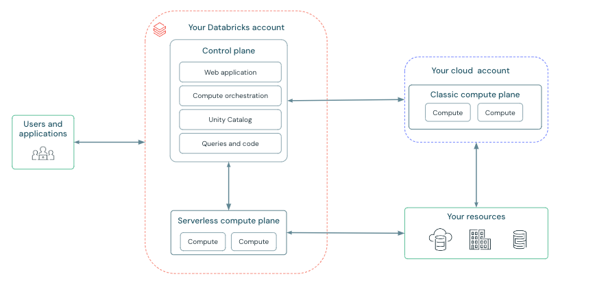
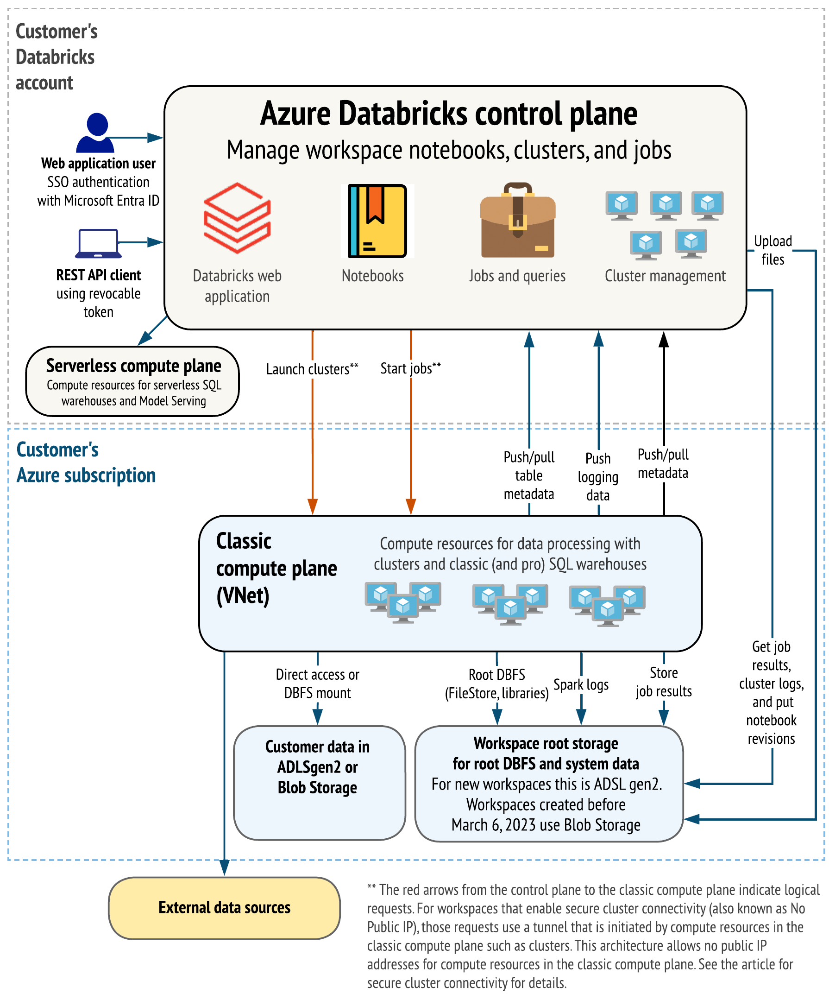
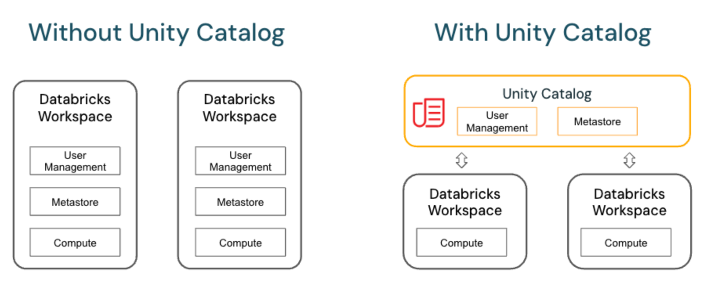

# NEW ARCHITECHTURE IMAGE

# OLD ARCHITECHTURE IMAGE

# CONNECTION of DATABRICKS WORKSPACE to ADLS GEN2 :
	WAY 1 :
		- In databricks there is "DBFS" file system 
		- DBFS is a distributed file system for interacting with cloud object storage.
		- You can see that in CATALOG panel top middle
		- If its not visible for first time you have to enable visibility in settings, follow below steps
			1. Go to the settings page.
			2. Click the Advanced tab.
			3. Click the DBFS File Browser toggle to enable or disable the setting.
		- For mounting any cloud object storage to DBFS , you have to use below command
			configs = {.....} #depending on your authentication method used configs gets keys and values accordingly
			dbutils.fs.mount(
								source = "abfss://<container-name>@<storage-account-name>.dfs.core.windows.net/",
								mount_point = "/mnt/<mount-name>",
								extra_configs = configs
							)
	
	WAY 2:
		- you can use SPARK config method to set whatever config you want to get authenticated 
		- example :
			spark.conf.set("...","...")
		- Number of configs may change according to your choosen authentication type
		- If these configs are set in cluster level then everyone who has access to cluster can use it (less safe)
		- or in your program alone you can set it (more safe)

# Authentication types to connect to cloud OBJECT storage :
	- ACCESS KEYS :
		spark.conf.set(
						"fs.azure.account.key.<storage-account>.dfs.core.windows.net",
						"<storage-account-access-key>"
						)
	- Shared Access Signature (SAS) :
	- Service principle

# Architecture elements of AZURE DATA BRICKS :
	Contol plane :
	Compute plane :
			Srverless Compute Plane :
			Classic Compute Plane :
	Data plane :

# Unity catalog  :

	Note:- "UCMETASTORE" is different from "LEGACY HIVE METASTORE" and "UC ENABLED HIVE METASTORE"

	Go to "https://accounts.azuredatabricks.net/" to access all workspaces and metastores
	Contributor role at IAM of workspace is required (Subject to change)
	Although how other workspaces are supposed to show up here if Contributor role at one workspace is enough is the question ?
	In Azure while creating Worskspace choose the PRICING TIER as PREMIUM . only in that UNITY CATALOG is available

	### MAIN FEATURE :
.	

	-	Main difference between Unity catalog and Legacy Databricks system is a CENTRALIZED metastore
		where its unified governance system makes it possible to share its data objects like Tables and views accross
		the Databricks workspaces under one account (Subject to corrections)
	
	- For cross platform Sharing study about DELTA sharing 
	- One DataBricks Workspace can only be attached to one METASTORE
	  But One Metastore can be attached to more than one Workspace 
	- CONSTRAINTS BASED ON REGION (As of 2025May04)
		Only One Metastore per region per account , If Exception is needed direct connection to DATABRICKS company is needed. 
		More than one WORKSPACE can be created per region

	- Legacy Hive metastore is local to workspace before UNITY catalog (Subject to correction)
	- The Hive metastore present inside UNITY catalog metastore is shared accross all workspaces attached to same UCMETASTORE(need to check)
	- LEGACY HIVE METASTORE requires COMPUTE to even see the tables and schemas under it 
	-

	CLUSTER SETTINGS :
		POLICY :
			Unrestricted
		ACCESS MODE :
			Single User
			Shared
			No isolation Shared

	? is hive meta store catalog local to workspace
	? does cluster being uc enabled or not have any effect on accesing data of UCMETASTORE

## Heirarchy of UNITY CATALOG
	1. Account level : 
			- Each Account (DataBricks or Azure) can contain N number of Workspaces and M number of 
				metastores(but only one metastore per region)
	2. Metastore :
			- Each metastore can contain N number of catalogs
			- "Hive metastore" , "samples" , "system" , "<your workspace named catalog>" these catalogs come by default
	3. Catalog : Collection of DATABASES or SCHEMAS
	4. Schema / database :
	5. Tables , Views , functions

	When cluster is not started or not attached there is the following behaviour :
		1) Catalog will show tables present in all schemas except hive metastore
		2) DBFS file browser will show "hive metastore tables" but not normal catalog schema tables

# DELTA SHARING :
	Used to share Data between either DATABRICKS to DATABRICKS or DATABRICKS to OUTSIDE WORLD
	For this Unity catalog needs to be enabled (Need to confirm)

	To Enable DELTA SHARING :
		Go to metastore UI page (https://accounts.azuredatabricks.net/)
		select the metastore 
		Click on DATA tab 
		Click on "Enable DELTA SHARING" option

# storage areas of DATA bricks elements :
	Notebooks :
	Results displayed in Notebooks :
	Compute resources :
	Workflows :
	Tables :
        

# Checking how different tables behave :
	- Managed tables (Will always maintain data in DELTA LAKE storage)
	- External tables
	- Views
	- Streaming table
	- Delta LIVE table
	- Streaming live table

	- Copy command
	- Autoloader

	- Permissions on objects

	Managed tables (Will always maintain data in DELTA LAKE storage)
			create or replace table y_most_basic_table 
				as
				(
						select 'r1c1' as COL1 ,'r1c2' as COL2 ,'r1c3' as COL3
				)
	External tables
	Streaming table
	Delta LIVE table
	Streaming live table

####################################### Prof certificate ROUGH WORK ##START ###################################################

Workflows 
	JOBS
		TASKS
			Notebooks or scripts 

dbutils.jobs.taskValues.set(key   = "my-key", \
                            value = 5)
dbutils.jobs.taskValues.get(taskKey    = "my-task", \     --->>> I think this is name of activity in workflow or ntbk name
                            key        = "my-key", \      --->>> Think of it as a variable
                            default    = 7, \ 
                            debugValue = 42)              --->>> if you are debugging a notebook previous Set has not yet run
	In a pipline , you can use this to set or get any particular parameters which needs to propogate information acrros 
	the tasks with in  a job 

dbutils.notebook.run("My Other Notebook", args ,  60) :  -->>> 60 is timeout 
dbutils.notebook.exit("My exit value")

dbutils.secrets.get(scope="my-scope", key="my-key"):
				.getbytes(..)
				.list(..)
				.listScopes(...)

dbutils.widgets......
dbutils.widgets.get('fruits_combobox')

CDC vs CDF 
	CDF is useful when only small fraction of data is changed in each batch
	table_changes ( table_name, start_time [, end_time ] )

	If you run above method using select , it returns below cols along with tables cols

	_change_type STRING NOT NULL
	Specifies the change: delete, insert, update_preimage, or update_postimage

	_commit_version BIGINT NOT NULL
	Specifies the commit version of the table associated with the change.

	_commit_timestamp TIMESTAMP NOT NULL

	CREATE TABLE myschema.t(c1 INT, c2 STRING) TBLPROPERTIES(delta.enableChangeDataFeed=true);
	(spark.readStream
	.option("readChangeFeed", "true")
	.table("myDeltaTable")
	)

	-- providing only the startingVersion/timestamp
	SELECT * FROM table_changes('tableName', 0)

	-- database/schema names inside the string for table name, with backticks for escaping dots and special characters
	SELECT * FROM table_changes('dbName.`dotted.tableName`', '2021-04-21 06:45:46' , '2021-05-21 12:00:00')

	spark.read \
	.option("readChangeFeed", "true") \
	.option("startingVersion", 0) \
	.option("endingVersion", 10) \
	.table("myDeltaTable")

	spark.read \
	.option("readChangeFeed", "true") \
	.option("startingTimestamp", '2021-04-21 05:45:46') \
	.option("endingTimestamp", '2021-05-21 12:00:00') \
	.table("myDeltaTable")

	set spark.databricks.delta.properties.defaults.enableChangeDataFeed = true;

microbatch._jdf -->> question 15 .. its asking for runtime less than 10.5
Question 38 says contrary to above 
it says just use microBatch.sparkSession.sql()

Study about dataframe writer .mode options there seems to be an ignore option too
	Overwrite
	Append
	Ignore -->> if file already exists it ignores writing without any error
	error  -->> If file already exists it raises an error

mlflow pyfunc spark_udf :
	mlflow.pyfunc.spark_udf(spark, model_uri=logged_model)

TRIGGERS :
	df.writeStream \
	.format("console") \
	.trigger(processingTime='2 seconds') \
	.start()

	.trigger() # default is 500 ms , you dont have to add .trigger in df write stream
	
	.trigger(availableNow=True) \ # Means the stream has to consider all the data from its previous batch run 
									and process it and next stop the cluster and job 
	.trigger(once=True) \ Might be active in Autoloader , but mostly saying its depricated , instead use availablenow

	.trigger(continuous="1 second") \   # trigger intervel is 1ms compared to default 500ms , its experimental as of 2025mar

ACCESES related :

	Table level acceses :
		Apply tag
		Select
		Modify - only delete , add , update data
		Manage - owner like permission to drop table or manage permissions to other  users
		All provilages 

	Cluster access :
		Attach to
		Can restart
		Manage -->> can manage permissions and edit cluster config 
		Allow cluster creation

		View SPARK UI and Computer metrics -->> Can attach to permission enough
		View Driver logs                   -->> Can manage permisiion
		Edit cluster config                -->> Manage permission

	Group cannot be owners of the job only individual users can 

All Describe cmds
	DESCRIBE my_table_name = just gives tables columns info
	DESCRIBE DETAIL my_table_name = just gives tables metadata info
	DESCRIBE EXTENDED my_table_name = It gives out both columns list and metadata info 

Ganglia UI

ASSERT
	for SQl = select assert_true(condition [, message])
	For python = assert tableExists(tableName, dbName) is True

Databricks CLi and rest APi study
	REST API :
		GET 
		PUT is also there 
		POST
		PATCH -->> for update 
		DELETE

		200 - sucesss
		404 - not found
		401 - unauthorized
		500 - internal error

	curl --request GET "https://${DATABRICKS_HOST}/api/2.0/clusters/get" \
		--header "Authorization: Bearer ${DATABRICKS_TOKEN}" \
		--data '{ "cluster_id": "1234-567890-a12bcde3" }'

WATERMARKING :
	.withWatermark("timestamp", "10 minutes") \
	(max event time seen by the engine - late threshold > T)

	For understanding watermark , the offical doc's time graph and its example data might confuse you
	Easy scenario to think is real time data generated by an IOT device , try to understand Streaming through this 
	Not through the example in oficial doc

df.dropDuplicates()
df.dropna()

OPTIMIZE : 
	Q19,Q26 says Auto optimiza will consider 128 MB file sizes 
	    	Standard optimiza considers file sizes of 1 GB 
	
	Auto optimize will not do Z ordering as it is costly operation
	In spark default partition block size is 128 MB , thats not fixed we can change it from configs
	In databricks when we run optimize cmd , any file that is less than 1 GB size will be merged

	Z-order -> sorts data by column values , it doesnt consider newly arrived data , for that you need to explicitly run 
				OPTIMIZE table_name [FULL] [WHERE predicate]
				[ZORDER BY (col_name1 [, ...] ) ]
	
	CLUSTER BY -> colocates similar data based of mention column names 

	Liquid cluster -> Does same thing as CLUSTER BY , but its automatic and periodic running with out human intervention

	Compaction :
		Sees if files can be merged together 
		OPTIMIZE table_name
		deltaTable.optimize().executeCompaction()
	
	Bin packing :
		Evenly ditributes files based on size
	
	spark.databricks.delta.autoCompact.maxFileSize

	ALTER TABLE <table_name> UNSET TBLPROPERTIES (delta.autoOptimize.autoCompact)

	Auto compaction doesnt support Z ordering
	Z-ordering is very costly compared to compaction

	In file statistics collection first 32 columns will be used 
	and for nested columns each nested value will be considered as a column
	for example 4 struct field columns with each 8 nested fields will be considered as 32 cols

	Files cannot be compacted accross the partitions even if you run optimize 

TIME TRAVEL :
	SELECT * FROM my_table VERSION AS OF 2
	SELECT * FROM my_table TIMESTAMP AS OF '2024-01-27 11:37:00';

	Delta Log Retention:

		Property: delta.logRetentionDuration

		Default: 30 days

		Purpose: Determines how long the Delta transaction log history is retained. This log contains metadata 
		about all changes made to the table.

	Deleted File Retention:

		Property: delta.deletedFileRetentionDuration

		Default: 7 days

		Purpose: Specifies how long deleted data files are retained. This is important for time travel, 
		as it allows you to query previous versions of the table.

	VACUUM Command:

	Purpose: Removes old data files that are no longer referenced by the Delta table. Running VACUUM helps free up storage space.

	Retention Window: The default retention window for VACUUM is 7 days. You can adjust this by setting the delta.deletedFileRetentionDuration property.

	Example:

	sql
	VACUUM table_name RETAIN 30 Hours ;

	RESTORE TABLE my_table To version as of 3

	Study about @v syntax also 

	While streaming , if any of the source table deletion should nt break streaming use option ignoreDelete
	spark.readstream.table(...).option("ignoreDelete",True).writeStream.....
	

Q47 in pe1

dbfs:users/hive/warehouse/db_hr.db

SPARK UI query details page 

#Databricks notebook source

Partial fail and full fail of tasks in workflows study about it 

JOINS ON STREAMS :
	In STREAM joins all the past inputs are buffered to match and do comparision with upcomming future inputs 
	This past window can be controlled by watermarking

	In stream static joins , in every micro batch latest version of static table will be used
	for doing join with streaming

####################################### Prof certificate ROUGH WORK ## END ###################################################
