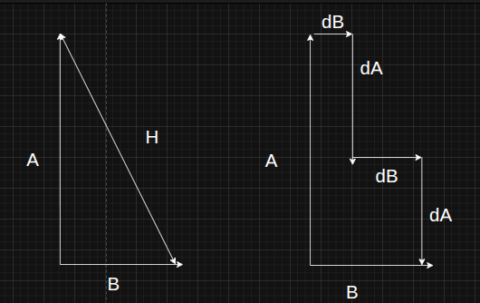

Spark RAPIDS Accelerator --> for Spark to use GPU computing

Python bindings are interfaces that allow Python code to interact with libraries written in other programming languages, such as C or C++

Q)  If pyspark is just a API library whose actual executables are present in APACHE SPARK BINARIES , then how is pyspark
    working properly without installing APACHE SPARK.
A)  I think pyspark does come with light weight SPARK BINARIES enough to execute PYSPARK APIS without any 
    cluster management part 

Clean later -->> Spark analogy pt in this file is 7 MB try reducing the size later /home/yvm/Documents/y_youtube/y_youtube_teaching/y_pyspark/y_pyspark_batch.md

CL) Iterators vs generators
CL) Clousures and decorators
CL) Python multi threading vs multiprocessing and CPU Pooling through map reduce 
    REF = https://www.youtube.com/watch?v=PJ4t2U15ACo&list=PLeo1K3hjS3uub3PRhdoCTY8BxMKSW7RjN
CL) pyttsx3 - text to speech 
    REF = https://www.youtube.com/watch?v=u6cmiBp1obc
CL) openai whisper - speech recognizer
CL) pocketsphinx for speech rcognizer offline working 
CL) https://www.youtube.com/watch?v=SXsyLdKkKX0
CL) LANGCHAIN (HARRISON CHASE) , VECTOR DATABASES , AUTO GPT
CL) AI AGENTS vs AI MODELS
CL) RAG (Retrieval augmented generation)
CL) Vector databses
CL) Synchronous vs Asynchronous programming
    Python library - asyncio
CL) Subroutine vs coroutine
CL) Flink:
        Flink seems to be a competitor for SPARK STRUCTURED STREAMING 
CL) Informatica , DAG - bigdata tech 
CL) Kafka can be deployed on bare-metal hardware
    KAFKA CONNECTS
    KAFKA STREAMS
    KAFKA TOPICS

    MAP REDUCE FLATMAP
CL) ACL s (Access Control Lists)
CL) ATOMIC BROADCAST PROBLEM
CL) ANSIBLE vs TERRAFORM

CL) DBT like data bricks data engineering technology
    DBT vs ETL

CL) Emergent behaviours  
--------------------------------------- CET -- start -------------------------------------------------------------
NUCLEAR FUSION:
    Z Machine 
    Tokamak
    Stellarator

ELECTRONICS :
    SEMICONDUCTOR FABRICATION FACILITIES (FAB)
        FOUP is a machine that carries waffers from one machine to another in FAB
        Each SILICON WAFER has many Individual (INTEGRATED CIRCUITS or DIE or CHIPS)

LIGHT MATTERS (Company):-   May be pioneer in PHOTONICS , Where the communication between components will be replaced by light 
                            instead of electrons . In short replacing Circuits with fibre optics at nano scale.

1x (Company):-  Promising in Humanoid robotics

Wave energy from Ocean :
    CorPower Ocean (Company)

Magnetic coolers

The metal company (TMC)-
    Publicaly traded company enlisted on NASDAQ
    Mining 16 trillion dollar (subject to correction) worth of "METAL NODULE DEPOSITS" under OCEAN 
    Polymetallic nodule - nickel, cobalt, copper, and manganese
    NAURU country 
    CLARION - CLIPPERTON ZONE  (Ocean bed contains these nodules on its deep surface )

CL) DRAKE equation 
--------------------------------------- CET -- end -------------------------------------------------------------

--------------------------------------- Randomn questions -- start -----------------------------------------------------

    hypotenuse question :
        In the below diagram :

        a right triangle of sides A and B and hypotnous H -->> A2+B2=C2
        Will H = sum of all dA+dB 
        {dA = A/n , dB = A/n} n tending to infinity

--------------------------------------- Randomn questions -- start -----------------------------------------------------

---------------------------------------- Various tools -- start -------------------------------------------------------------

PCB WAY -->> for 3d printing , CNC cutting PCB 
    In PCB manufacturing there are few ways of creation
        SMT - Surface mount technology
        THT - Through hole technology 
        HDI - High density interconnect
        BGA - Ball grid array

Video Editing :
    PICSART web based tool for AI enhaced removals 
    
---------------------------------------- Various tools -- End -------------------------------------------------------------

PYTHON :
    iterator vs generator
    closure and decorator 
    Is there any performance improvement in list comprehension or just a compact way to write code
    Study about "ENUMARATOR vs ZIP" in python for looping 

    SPARK REPL(READ EVAL PRINT LOOP)

---------------------------------------- English -- start --------------------------------------------------------
Speakers :
    Christopher hitchens 
    Jordan peterson

vocabulary :
    prevalent - widespread in a particular area or at a particular time
    modus operandi - a particular way or method of doing something
    frivolous - not having any serious purpose or value
    republic - a state in which supreme power is held by the people and their elected representatives, 
                and which has an elected or nominated president rather than a monarch.
    Democracy vs republic - both are same except one change where in republic majorities power will be kept in check
                            So that it does nt overshadow the minority 
    India is a Sovereign Socialist Secular Democratic Republic

    competent - having the necessary ability, knowledge, or skill to do something successfully
    comprehend  - grasp mentally or understand
    comprise - consist of ; be made up of

    voracious - wanting or devouring great quantities of food
    articulate - having or showing the ability to speak fluently and coherently
    eloquent - fluent or persuasive in speaking or writing

    antithesis - a person or thing that is the direct opposite of someone or something else.
    rhetoric - language designed to have a persuasive or impressive effect, but which is often regarded as lacking in sincerity or meaningful content.

    etymology - the study of the origin of words and the way in which their meanings have changed throughout history.
    disingenuous - not candid or sincere, typically by pretending that one knows less about something than one really does.

    agnostic - a person who believes that nothing is known or can be known of the existence or nature of God
    silos - a tall tower or pit on a farm used to store grain
    Corpus - a collection of written texts, especially the entire works of a particular author or a body of writing on a particular subject.
    isochrome maps - Distance that can be covered in a constant time with constant velocity ,
                     Ideally speaking it would be CIRCLE in 2D and SPHERE in 3D,
                     But rethink the same thing when there are only certain curvy roads that you can take in a particular direction in 2D

    contentious - causing or likely to cause an argument; controversial

    STOCHASTIC - involving or characterized by a random probability distribution or pattern. It implies an element of chance or randomness, 
                 where outcomes are not entirely predictable but can be analyzed statistically
---------------------------------------- English -- End ---------------------------------------------------------

--------------------------------------- Blender shortcuts -- start ------------------------------------------------------------

Shift + k = Hold cut the strip
Shift + s = Move all strips starting point to the time LINER (the blue line that moves when you play )

--------------------------------------- Blender shortcuts -- end ------------------------------------------------------------

labcorp:
    te :y90355-w78441
    2 days office hybrid
    2pm to 11pm
    AWS Databricks
    31.9
    12% basic PF
    21 days annual leave upto 15 days encash per year

    10% of fixed is 

--------------------------------------------------- gather from various sources -- start ---------------------------------

----- Put them in their places later 

---------------- Gen ai -----------------------

AZURE AI FOUNDRY 

Playground tensorflow 

? In neural networks , how to decide for the same number ofnodes should they be assigned with increased number of hidden layers or should they be placed in just one layer 

 

Tensorflow KERAS 

Pytorch 

https://github.com/a-forty-two/stackroute-08May-GenAI-Batch4/blob/main/01-IntroToDeepLearning%20(1).ipynb 

Porter stemmer 

Spacy , NLTK are dictinaries 

The higher dimension axises mean nothing in terms of features , that is atleast to humans , 

We give text corpus and number of dimensions it should embed , machine will assign some feature that only it understands ,  

In short those axises will have meaning in the eyes of machine , but from human perspective we might not comprehend what it is  

Token vs encoding vs embedding  

python -m spacy download en_core_web_lg 

https://github.com/a-forty-two/stackroute-08May-GenAI-Batch4/blob/main/02-IntroToNLP.ipynb 

Displacy renders relation between words in sentence  

-------------- while studying for data bricks certs -------------

Auto loader : 

    Check pointing  

    Water marking  

    Write ahead logs 

Spark Structured Streaming: Tutorial With Examples 
 
Tumbling window  
Sliding window 
Session window 

APache spark  
Apache flink 
Macrometa 

-------------------------- Some thing I am not sure of ---

Cost of an operation ? 

SHARDING ? 

MAGIC NUMBER? 

Cloud files ? 

DICTIONARY ENCODING , RUN-LENGTH ENCODING ? 

CLUSTERED AND NONCLUSTERED WAY ? 

Lambda vs  kappa architechture? 

Normalization vs Denormalization ? 

Apache BEam? 

Structured streaming foreachBatch ? 

-------------------------------- kafka 

------------------------------- Apache spark --

SUMMARY : 

 

?)  What is DATA SKEW 

?)  RDD lineage vs SPARK DAG 

?) Cores vs threads 

?) (Onheap vs overhead vs Offheap) memory  

?) spark.sql.shuffle.partitions  ---->> why default value is 200 ? 

?) Catalyst optimizer and Tungsten 

?) Executor memory vs executor memory overhead 

?) Whole stage code gen 

 

 

 

-> Number tasks that get triggered is equal to number of partitions after shuffle  

 -> SPARK : 

Rule based optimization vs cost based optimization 

 

If two applications are run on same clusters , then both the applications will run on separate set of driver and executor programs 

 

 

Executors vs slots  

 

 

WORKER_NODES  ---->> EXECUTORS --->>> SLOTS (each slot has one CPU) 

 

Read exchange vs Write exchange 

 

 

-> JOIN STRATEGIES : 

Shuffle hash join :  

After shuffling (getting similar data into partitions on same nodes) is done , the data in the partition will be hashed so that it will be O(1) for looking up 

Shuffle sortmerge join :  (prefered default strategy) 

After shuffling (getting similar data into partitions on same nodes) is done , all the data in those partitions will be sorted before any wide transformations 

Broadcast hash join : 

Broadcast a smaller data frame to all the nodes and then ash the smaller DF , then you can join . 

There is a spark config ("spark.sql.autoBroadcastJoinThreshold") size  

Broadcast nested loop join : 

Hashing works better when in join conditions if we are looking for one column equals another , 

But what if the condition is > or < in between two columns , in that case each column value in one table has to be checked against  

each column value in another table , so kind of like N*M combinations are needed 

Cartesian join (a.k.a Shuffle-and-Replication Nested Loop ): 

The job that is expected from this is every row in one table should be connected with every row in other table so , 
This join strategy does instead of shuffling , it replicates each partitions copy in every other executor node , 

If you are thinking this feels like a disadvantage , awnser is no ,  

Because only one table will be replicated like that , the other table will be mainitained as single replica in their respective nodes 

 

 

 

-> HASHING ADVANTAGE (needs revision might be wrong ) : 

 

Example Scenario : find out if 's' present  in the list ['a','h','e','s','u','q'] 

 

Any other method than HASHING  : 

Step1 : Have an understanding of index that program is currently present at by index checking , and do index increments after all below steps completed 

Step2 : Do a value comparision inside the index that we got from step1 , based on match or mismatch proceed further 

Step3 : any remaining logic 

 

If Hashing is Done on the array : 

my assumption of hashing  -->> Hashing_function(array value) = will give out a memory location to store that particular array value 

 

Step1 : will be same as above mentioned step 1  

Step2: There is no step 2 because its not necessary to check value matches or not , because whatever value we are looking for gave us this location after hashing , 

   then the value location storing Might also have given the same location output when sent to hashing function …. so by transitive they will be equal.  

Step3: remaining logic 

 

 

 

-> SPARK PARTITIONING  : 

There are two kinds of classification of understanding partitioning : 

TYPE 1: 

DISK PARTITIONS : 

These are the partitions in which HDFS decided to store in the disk 

Memory Partitions : 

When spark data reader reads the data into memory , it forms partitions in memory in its own way , irrespective of how  

It was there in DISK . 

TYPE 2 : 

INPUT PARTITIONING :  

Think of all the already partitioned data in HDFS as one single data set , Spark data reader decides to read the DATASET while creating the partitions  

In its own way into the memory  irrespective of how it was partitioned in DISK 

While reading into memory , DEFAULT SIZE of single partition is 128 MB ,  

"spark.sql.files.maxPartitionBytes" this spark config can be set to change the size from 128 MB  

OUTPUT PARTITIONING : 

While writing on to a DISK how is data frame writer choosing to partition data 

Tools for in memory partitions adjustment include : 

Repartion() 

Coalease() 

PartitionBy()  

SHUFFLE PARTITIONING : 

After INPUT PARTITIONING is done , before doing any wide transformations , it shuffles data again between nodes based of WIDE TRANSF conditions 

"Spark.sql.shuffle.partitions " this spark config property can be used to set number of shufle partitions (default 200) 

 

The data partitions structure involved in how spark reads data in memory as default 128 MB size , will not be same once data shuffle happens to  

Perform dataframe transformations 

 

->  How many partitions are good to have : 

In spark each partition is assigned to a task , each core can take one task , 

So how many cores you have will properly guide you on how many partitions you should have = ((cores/node)*(number of nodes you have)) 

 

-> what will you do if your data frame has large number of rows and each row is unique and no way of partitioning together , How will you optimize this for computation: 

My guess is : 

Reduce number of shuffle partitions from 200(default) to less number. 

-> SPARK PARTITIONING STRATEGIES : 

Hash partitioning (Default) 

Range partitioning 

 

 

 

 

-> SPARK HINTS : 

Theese are compiler directives that will be given in the code data frames or sql on how spark should execute theese 

Like which "join startegy" (note not those inner left right join stuff ) or partition managements 

df = spark.read.format("delta").load(trxPath) 
.hint("skew","<join_column>")  

Or 

SELECT /*+ your hint */ * FROM t;  

  

->  

-> How to solve OOM exception : 

Why this exception comes : 

Solution for this : 

Salting : 

AQE : 

 

-> How to solve data skewness ISSUE : 

Just use SKEW hint as described above and also exercise Adapative query engine of sprk 

spark.conf.set('spark.sql.adaptive.enabled', True) 

spark.conf.set('spark.sql.adaptive.skewedJoin.enabled', True) 

 

One of two things might happen based on a check  : 

IF { SIZE(SKEWED_PARTITION) > 256 MB }  or {SIZE(SKEWED_PARTITION) > 5*MEDIAN_SIZE(all remaining partitions )} : 

AQE will Split biggest partition into smaller ones 

ELSE : 

Smaller partitions will be added together to be similar in size to most skewed partition 

 

 

-> Both executor program and driver program uses WORKER nodes  

 

->  Persist() vs cache() : 

Cache() = persist(storage_level.<option>) 

Persist and cache more or less does storing of intermediate data in memory , for that storage operation we have various options to choose like "MEMORY_ONLY" , "STORAGE_ONLY" , "MEMORY_AND_STORAGE" 

Cache() is special case of persist 

We have six options to pass to PERSIST as arguments : 

MEMORY_ONLY 

MEMORY_AND_DISK 

MEMORY_SER 

MEMORY_AND_DISK_SER 

DISK_ONLY 

MEMORY_ONLY_2  : 2 is the replication factor for redundancy 

 

 

 

-> Serialized vs deserialised data : 

Serialization is converting any data object into byte code , 
That byte code is used to store in DISK or transfer through networks  

Any program has to do deserialization before using that object for what it is 

SERIALIZED DATA is more compact  

SERIALIZE to DESERIALIZE --> requires CPU 

 

 

Spark-submit in edge node --->> YARN assigns a worker node to start driver program where Application master is  

 

 

Memory allocation : 

YARN memory restrictions : 

yarn.scheduler.maximum-allocation-mb     ---->>> physical memory limit of worker node 

yarn.nodemanager.resource.memory-mb 

 

DRIVER memory : 

spark.driver.memory = x GB             ------>>>>> "JVM proceses" memory 

spark.driver.memoryOverhead = max(384 MB , 10% of x GB)  ------>>>> "Non JVM processes" related memory 

 

EXECUTOR memory : 

spark.executor.memory =  y GB  

spark.executor.memoryOverhead = 10 % of  y GB 

spark.memory.offHeap.size = your wish default 0 

spark.executor.pyspark.memory = your wish default 0 

 

 

           Note : "Pyspark executor memory " is a non JVM memory so it has to use memory overheads 

 

 

 

 

APPLICATION : 

JOB : Each "ACTION in spark" creates a JOB 

STAGE : Each "WIDE DEPENDENCY TRANSFORMATION" creates a stage  

TASK : 

 

 

 

-> Default partition size of each file that spark works upon is 128MB 

-> Default number of partitions that will be created while doing JOIN operations is 200: 

In case if we have join performing on data which managed to fit in two partitions , it still creates 198 empty partitions 

 

-> Bucketing : 

Bucketing is a technique which shuffles data and store to DISK based on your given columns , 
But how does it differ from "PARTITIONBY()" : 

If you use partitionBy() and store data according to your columns it stores fine , but during any wide transformations it again  

Performs shuffling operation . 

So Bucketing eliminates the shuffling while wide transformations , because it allows us to PRESHUFFLE while our writing to disk stage itself 

Any datasets on which wide transformations are happening , for bucketing to properly take effect , both the data sets should have been bucketed before 

And that too on same columns . 

Bucketing can write to DISK as TABLE format only , not as CSV 

 

 

-> SALTING (As a solution for data skewness) : 

When join operation is happening between two dataframes , and in one dataframe data is skewed , 

Our solution is to break that skewed partition which was made on a column , 

But no matter what we do like repartion or partitionby before JOIN statement executes , its useless , 

Because while joining it shuffles again , 

So our approach should be ,have temp new columns in both data frames which somehow breaks this skewed partition into smaller one while shuffling 

You can create a new column in both data frames called SALTED_COLUMN and perform join on that column instead. 

Note : A video of photos on spark memory management is present , thats very crucial knowledge.

Serializers  

JAVA (default) best for JAVA objects 

KRYO seriazers introuced by spark (best for RDD and dfs) 

Encoders for data sets 

 

Predicate push down = filters and get required rows 

Projection push down = filters and get required columns 

Partition pruning = Filters and gets only required partitions 

Dynamic partition pruning =  Predicate push down + Partition pruning + Broadcast join 

 

 

 

Spark 1.x catalyst optimizer 

Spark 2.x cot based optimizer 

Spark 3.x AQE(adaptive query execution) 

 

AQE Operates primarily after the SELECTED PHYSICAL plan area , 

When the a stage has been completed the next stages plan will be adapted to best one based on completed stage 

AQE automatically handles the best number of partitioons , either by coalscing or dividing the skewed partition 

 

 

------------------------------- Databricks ----

Data bricks vs AZURE data bricks ? 

 

FOR "Databricks Certified Associate Data Engineer" 

 

Summary  

-> Data bricks is a  lake house platform  

-> Data bricks provides two types of clusters : 

      1) All purpose clusters for interactive development  (check again – this doent get terminated or deleted after use) 

     2) Job clusters for automating workloads (check again – this gets terminated and deleted after use) 

-> (not sure ) entry point for data storage seems to be = "dbfs:/databricks-datasets/"     "dbfs:/databricks-results/" 

-> To read any of fileformats from the DATABRICKS locations using SQL , use below format : 

      Select * from <fileformat>.`{<path variable of the file>}`                --->>> <> indicate info between them to be interpreted by us 

-> Spark has catalyst optimizer , which doesn’t have effect on UDF s 

-> check constraint can be added to a column in sql 

-> Vacuum (used to set retention period for time travel)  and RESTORE cmd (used to do time travel)  

-> Medallion architecture has this (BRONZE SILVER GOLD layers) 

 

?) Study tutorial 15 again – Query files directly heading 

?) Delta Live Tables 

?) Unity catalog  and Managing data access with it works 

?) what is object storage (I think mostly in cloud storages)  ----- storage for unstructured data where each item has unique ID and it is bundled with Meta data 

?) Dataframe READER and WRITER 

?) DATABRICKS run time --> 11.3 

?) Multi cell databricks notebooks 

?) Cluster access control 

?) What is DBC? 

?) Cluster compute policies  

?) DBU Per hour in DATA bricks 

?) Photon acceleration 

?) dbutils 

?) DA.cleanup() -- find out its equivalent 

?) Struct data type 

?) How to parse JSON in SQL and dataframe  

?) flatten , lateral flatten , collect_set , explode , PIVOT , UNPIVOT 

?) CASE , IF , DECODE statements in SQL and DATAFRAME 

?) In sql Describe vs Describe extended vs DESCRIBE DETAIL vs DESCRIBE HISTORY vs DESCRIBE FORMATTED 

DESCRIBE table_name  --->>>  Only gives column info 

 DESCRIBE DETAIL           --->>> Will give other meta data(like catalog , schema  , table format , data files path) rather than columns info 

DESCRIBE FORMATTED--->>> it is ( DESCRIBE + DESCRIBE DETAIL + other info ) 

DESCRIBE EXTENDED --->>> equal to DESCRIBE FORMATTED 

 

?) There is a different set of DESCRIBES for SCHEMAS too  

?) Why UDF s are slow 

?) Why sereialize and Deserialize 

?) Whats the role of PANDAS UDF in SPARK 

?) SCD , Dimension table fact table , snowflake star galaxy schema 
?) bronze layer and silver laver in data storage 

?) pyspark how to create delta lake  

?) Merge vs insert vs COPY INTO(Is idempotent)----- Truncate vs delete ---- primary key vs foreign key ----- INSERT VS INSERT OVERWRITE ----- PARTITION VS INDEX 

?) Incremental load in snowflake or DATABRICKS 

?) Delta lake cloning 

?) DELTA LAKE VS DELTA TABLE VS DELTA LIVE TABLE 

?) Data bricks auto loader 

?) Create or replace vs create or refresh 

?) Normal table vs LIVE table 

?) LIVE SCHEMA 

?) Change Data Capture 

?) DLT constarints and expect 

?) data bricks dbt vs dlt 

 

 

?) connect to JDBC using spark sql and dataframe api code 

?) spark incremental load 

?) Azure data lake ,  Delta Lake , Delta live tables 

?) unity catalog data lineage 

?) Control plane vs cdata plane 

?) ganglia UI 

?) Azure key vaults 

?) ADLS credential pass through 

?) dbutils 

      Dbutils.fs.help() 

      Dbutils.secrets.help() 

?) abfs vs abfss vs dbfs 

?) Ways to gain access to azure data storage : 

Access key   (through dbutils.fs.mount() or spark.conf.set()) 

SAS token  (through dbutils.fs.mount() or spark.conf.set()) : 

SAS gives ability to AUTHORIZE each action in perticular folder and file wise , its better than ACCESS KEY approach 

Service principle  (through dbutils.fs.mount() or spark.conf.set()) : 

1) Imagine service principle as creating a USER ID and PASSWORD for APPLICATION rather than humans 

2) You can create that in Microsoft entra and inside APP registrations and create secret access key in APP REG itself 

3) Once you do that, you have a APP( "USERID" (client id , tenant id)and "PASSWORD"(secret access key)    metaphorically) hanging around 

     With no AUTHORIZATION on anything and no APPLICATION actually using this for AUTHENTICATION 

4) Use theese "ID" s and "SECRETKEY" in data bricks as it uses these to get authenticated for azure services 

5) Go to ADLS and assingn a role or access policy to this SERVICE principle to contribute to this AZURE service 

MANAGED IDENTITY : 

 

"Access connector for azure data bricks" along with "UNITY CATALOG STORAGE CREDENTIAL" (prefered  way) : 

 

 

?)  

 

?) Assign databricks workspace to unity catalog 

 

?) One metastore per region 

 

?) Delta lake ->" optimize" and "z order" 

-> All purpose clusters , Job clusters , Cluster pools 

-> Magic commands in data bricks cells 

     %python   - python interpreter 

     %sql   - sql interpreter 

     %scala   - scala interpreter 

     %fs  -  filesystem  

     %sh  - shell interpreter 

 

-> access keys for ADLS accounts give full access 

     SAS (Shared acess signature) gives granular access ability 

 

-> Session scoped auth   vs   Cluster scoped auth 

-> data bricks heirarchy  (could be wrong) 

DATABRICKS 

WORK SPACES 

USERS email accounts 

 

 

 

-> Data bricks account admin 

METASTORES    and      WORKSPACES  (check if we can assign meta stores to ws) 

CATALOGS 

SCHEMAS or DATABASES 

 TABLES nd all other database objects 

 

-> METASTORE : 

Each meta store has four catalogs : 

Hive_metastore : 

Samples : this is coming only when cluster is added 

System : This catalog`s information schema is taking notes of objects created in "Workspace_name_that_you_created" but not  

      In hive_metastore 

Workspace_name_that_you_created : 

 

->  ( AZURE STORAGE ACCOUNT ) 

| 

|      <Assign a policy to below connector using IAM in storage UI> 

v 

      (ACCESS CONNECTOR FOR AZURE DATA BRICKS) 

| 

|      <Above access connectors ID , when give in below meta store understands which ADLS storage account we are talking about> 

v 

      (DATABRICKS METASTORE) 

 

 

 

 

 

-> Delta lake transaction logs default will be kept for 30 days  

-> after every 9 transaction log files a checkpoint file will be created , so in summary Delta lake has to only go through 9 transac logs + 1 check point file 

-> VACCUM 's default retention period is 7 days 

     For making it less than 7 days you have to set this spark conf as false  --->> spark.conf.set('spark.ataricks.delta.retentionDurationCheck.enabled','false') 

-> CONVERT TO DELTA (it converts normal parquet tables to delta and also it works on just parquet files too read more about it) 

 

 

 

 

 

-> Structured streaming : 

It has features like : check pointing 

    Statefullness 

    Write ahead lgs 

     Watermark 

Write output mode : 

Append = its like insert into command for new records only , if old records are with outdated data it doesn’t correct it 

Complete = its like insert overwrite 

Update = update only 

 

 

->  DELTA LAKE : 

DELTA is a layer on top of storage layer which adds some additional functionality , like meta data handling and gives ACID capabilities 

SYNTAX to read delta atble : 

from delta.tables import DeltaTable 
delta_table = DeltaTable.forPath(spark, "tmp/table1") 

 

OPTIMIZE : 

It’s a digital janitor which takes care of optimizing DELTA LAKE through below ways : 

COMPACTION : 

Compact large number of small files into small number of big files 

delta_table.optimize().where(filter_condition).executeCompaction() 

 

If you want to compact only a small portion of the tables delta files , you can try filtering data as shown below 

OPTIMIZE delta_table_name WHERE date >= '2017-01-01' 

 

Z-ORDER : 

If you want to physically group similar data together based on a column , you can do as below 

delta_table .optimize().executeZOrderBy(<columns in quotes seperated by comas>) 

 

VACCUM : 

------------------------------------ SQL preparaton ---

1) Different kinds of keys : 

 

Primary key :  

Minimum tuple of columns that are required to identify a row uniquely 

Candidate key : 

Tuple of columns that are required to identify a row uniquely 

Super key : 

Consists of tuple of all possible column values which identifes a row uniquely , and candidate key is the least subset of super key 

PRIMARYKEY   is_subset_of   CANDIDATEKEY  is_subset_of   SUPERKEY 

Secondary key / Alternate key: 

SUPERKEY – PRIMARYKEY = all possible candidate keys other than promary key 

Composite key :  

It’s a key when primary key needs to consist of more than one column to uniquely identify a row 

Unique key : 

It helps identify each row uniquely , the difference between this and primary key is this can have null values 

 

Foreign key : 

Foreign key is a constraint that makes column in table_A to have values in the set of values present in PRIMARYKEY of table_B 

The relation is many(table_A) to one(table_b) 

On DELETE CASCADE : 

If a primary_key value is deleted from table_b and we want all connected FK table to delete their columns values too, then use  

 

 

 

 

2) TRUNCATE VS DELETE : 

1) Truncate is DDL and DELETE is DML 

2) Based on above point , we wont have roll backs on truncate 

3) Truncate drops table and recreates as empty table , while delete can be used with where clause to choose a subset to delete 

4) Delete removes data row after row , while truncate just unassigns datapages from the table 

5) Delete has the ability to activate triggers , while truncate doesn’t 

 

 

3) Indexes : 

You can think of it like contents page at the beginning of the book . 

There are diffirent types of indexes  

B-tree (default) : 

Its kind of like how you would search in english dictionary , based of some order either numerical or alphbetical 

Function-basedIndex : 

Suppose we have some mathematical operations on a column , you can create index on that after operated column like ((column1/100)+200) 

Clustered Index: 

BitMap index: 

 

4) TABLE PARTITIONS : 

Partitioning is physically placing similar data together for faster access , for example , placing data together monthwise 

 

 

 

5) Left semi join is equivalent to : 

SELECT name 
 

FROM table_1 a 
 

WHERE EXISTS( 
 

    SELECT *  

   FROM table_2 b  

   WHERE (a.name=b.name) 

) 

 

 Window functions syntax : 5 Practical Examples of Using ROWS BETWEEN in SQL (learnsql.com) 

 

SELECT <column_1>,  

  <column_2>, 

  <aggregate function> OVER ( PARTITION BY  <coma seperated columns>  

  ORDER BY <coma seperated columns> 

                                   <window_frame> 

                                  ) <column_alias> 

FROM <table_name>; 

 

 

 

Window frame in above statement , an example given below 

<window_frame> = ROWS BETWEEN lower_bound AND upper_bound 

Lower bound and upper bound can have below values 

UNBOUNDED PRECEDING – All rows before the current row. 

n PRECEDING – n rows before the current row. 

CURRENT ROW – Just the current row. 

n FOLLOWING – n rows after the current row. 

UNBOUNDED FOLLOWING – All rows after the current row. 

 

 PIVOT SYNTAX : 

 

SELECT CourseName,  

   PROGRAMMING, 

   INTERVIEWPREPARATION 
 

FROM geeksforgeeks  

 
PIVOT  
(  
 

   SUM(Price) FOR CourseCategory IN (PROGRAMMING,INTERVIEWPREPARATION )  
 

  ) AS PivotTable  

-------------------- Databricks practical -- 

PIVOT SYNTAX : 

 

SELECT CourseName,  

   PROGRAMMING, 

   INTERVIEWPREPARATION 
 

FROM geeksforgeeks  

 
PIVOT  
(  
 

   SUM(Price) FOR CourseCategory IN (PROGRAMMING,INTERVIEWPREPARATION )  
 

  ) AS PivotTable  

CHECK LATER 

 

?) DESCRIBE EXTENDED vs DESCRIBE DETAIL vs DESCRIBE HISTORY vs DESCRIBE FORMATTED 

PYSPARK DATE AND TIME  

 

DATE TYPE default format is "yyyy-MM-dd" 

 

MAIN FUNCTIONS : 

current_date()       -->>  outputs todays date in date type 

date_format ( <takes input in date type and reads it as yyyy-MM-dd>  ,  <Format that you want output as given inside quotes >)     ---->>> output is string type 

to_date (<takes input in whatever format > , <format in which it has to understand >)  ---->> output type is datetype 

 

Other functions : 

datediff (<end date >,<start date>) 

months_between (<end date >,<start date>) 

add_months (<date col or var>,<value to add>) 

date_add (<date col or var>,<value to add>) 

year(<datetype col or var>) 

month(<datetype col or var>) 

 

 

 

TIMESTAMP default type is yyyy-MM-dd HH:mm:ss:SS        --->>> SS is milli seconds 

 

MAIN functions: 

current_timestamp() 

to_timestamp( <col or var which contains your timestamp info > , <the format in which the info was given so that it can convert to default format>) 

hour() 

minute() 

second() 

 

 

 

ALSO STUDY ABOUT PYTHON datetime library 

PYSPARK DATE AND TIME  

 

DATE TYPE default format is "yyyy-MM-dd" 

 

MAIN FUNCTIONS : 

current_date()       -->>  outputs todays date in date type 

date_format ( <takes input in date type and reads it as yyyy-MM-dd>  ,  <Format that you want output as given inside quotes >)     ---->>> output is string type 

to_date (<takes input in whatever format > , <format in which it has to understand >)  ---->> output type is datetype 

 

Other functions : 

datediff (<end date >,<start date>) 

months_between (<end date >,<start date>) 

add_months (<date col or var>,<value to add>) 

date_add (<date col or var>,<value to add>) 

year(<datetype col or var>) 

month(<datetype col or var>) 

 

 

 

TIMESTAMP default type is yyyy-MM-dd HH:mm:ss:SS        --->>> SS is milli seconds 

 

MAIN functions: 

current_timestamp() 

to_timestamp( <col or var which contains your timestamp info > , <the format in which the info was given so that it can convert to default format>) 

hour() 

minute() 

second() 

 

 

 

ALSO STUDY ABOUT PYTHON datetime library 

-------------------------------- ADF 

-> AZURE ACTIVE DIRECTORY (MICROSOFT ENTRA ): for authentication 

     Azure IAM : for Authorization 

 

-> Integration runtime : 

Provides runtime and compute : 

Types: 

AZURE IR (default) : If the resources are on AZURE and on AZURE PUBLIC network then we can use theese 

 SELF HOSTED IR : If the resources are ONPREMISE or if they are on AZURE private network 

          Create a Self hosted IR , 

Download MSI in the system where your on premise resource is there  

Register that MSI with the key  

Done 

SSIS IR : 

 

    Linked service : 

For authentication and authorization between Azure services or onprem 

    Data sets : 

It’s a logical grouping of our data locations , DBs , files for ADF activities to use 

    PIPELINES : 

    DATAFLOWS : 

 

 

 

-> PARAMETERIZE all things in AZURE ADF: 

For every thing in ADF while creating it , there will be a parameter section where you can make dynamic inputs to any ADF resource    

Suppose if we want to copy tables in 10 different DBs , My original approach will be 

Create (10 linked services for each DB  + 10 Data sets + 10 Pipeline copy activity + may be inside only one PIPELINE + 10 triggers for all 10 activities) 

But if we develop our system Dynamically , All we need will be (1 of each things mentioned above + 10 triggers where actual values will be sent)  

 

Idea is simple think of every ADF REsOURCE like "methods with parameters"  and passing values responsibility falls on whoever is calling. 

 

The heirarchy of the VALUES flow into the PARAMETERS is as follows : 

Triggers (where we actually give actual values) 

| 

V 

Pipeline parameters 

| 

V 

Pipeline activity 

| 

V 

Data sets 

| 

V 

Linked services 

 

 

-> In ADF pipeline : 

For linke service option in ADF for DB do as below 

You create a service identity for the ADF pipeline and add it to databricks workspace IAM , to get access to all data bricks resources (video 156) 

 

-> ADF DATAFLOWS are converted into SCALA code and run in Intergration runtime 

 

-> "Self Hosted integrated RUN times" are to be installed in on premise system to connect to ADF 

 

 

 

-> For passing parameters to data bricks notebooks : 

-> Pass arguments in dbutils.notebook.run("path_to_notebook",{arguments}) 

 ?)check how to get theese arguments 

 

Or 

 

-> dbutils.widgets.dropdown/text() 

    Dbutils.widgets.get() , to get theese values from inside notebook 

 

-> For passing values from called notebook back to calling notebook : 

Dbutils.notebook.exit()   ---> kind of like return 

 

-> In ADF if you want to connect to any AZURE based services , just keep in mind LINKED SERVICE is option 

 

 

-> In ADF Pipeline you can graphically connect two activities based on success or failure  

-> If we want to get some values into our activity parameters , we can make use of  

"ADD DYNAMIC CONTENT " in that we can use "PREVIOUS ACTIVITY OUTPUT" too  

 

 

-> ADF pipeline activities : 

Copy : 

Get metadata : 

Stored procedure : 

LookUP: 

If condition: 

DATAFLOW: 

 

-> ADF pipeline triggers : 

Time based: 

Scheduled : Set the time , and the trigger keeps looking for if the current time matches with trigger time 

Tumbling window : instead of looking for matching time , it looks for is the mentioned duration done , 

   The advantage this duration look gives us , we can make it run for the past times too  

    Because its main purpose is not towait for the Exact time rather wait for duration , we can do concurrent runs for more than 

     One window time at a single time 

Event based: 

Storage based 

Custom event 

 

 

-> Service principle VS managed identity : 

Service principle : 

1) It can be thought of as a CREDENTIAL which when created is just in air , its attached to no service and given no authentication. 

2) Which ever program uses this CREDENTIALS it can be thought of as the CREDS is identifying a SERVICE though that service principle 

3) Next which ever target resouce needs to be accessed through theese CREDS , you can go IAM section of that service and assign some ROLES 

     Which gives authentication accordingly 

 

Managed identity : 

Simply it’s a special scenario of Service principle , 

1) Managed identity is created in the SOURCE service itself , so That identity is attached to that SERVICE alone  

2) Now in target resource which needs to accesed , go in IAM section assign role to the managed identity 

3) Whenever the managed identity is deleted , the deletion cascades the ROLES deletion in target resources too 

Types : 

System assigned : 

Only can be attached to one service 

User assigned : 

First create an identity and then assign this to how many ever SERVICES as you want  

 

?) ADF global parameters in manage tab 

?) self hosted integrated run time 

?) SSIS package 

---------------------------------- Machine learning 

Machine learning : 

Hugging face 

Bird based  

Transformer based 

Lama  index 

Lang chain 

 

 

 

 

Terms 

 

Tokenization 

Tagging 

Parts of speech tagging 

Lemmatization 

stemming 

Name entity recognization and relation 

chunking 

 

 

 

 ----------------------------------------- Azure synapse 

 Data -->> rowgroup -->> Segment -->> column store 

https://techcommunity.microsoft.com/blog/azuresynapseanalyticsblog/azure-synapse-analytics-dedicated-sql-pool-data-modelling-best-practices/3716772

DISTRIBUTION : 

HASH        -->> Better for BIG FACTS and DIM tables since while joining similar data stays near 

ROUND ROBIN -->> Better for staging tables no matter the size (As long as they are just for loading) 

REPLICATE   -->> Better for SMALL DIMENSION tables to avoid DMS(DATA MOVEMENT SERVICE) 

  

INDEXING: 

HEAP                                --->>> Better for staging tables (You explicitly have to mention this because DEFAULT is CCSI) 

CLUSTERED : 

CLUSTERED INDEX                 --->>> Indexed and as this is ROW stored , its better if entire row is being retreved 

CLUSTERED COLUMNSTORED INDEX    --->>> Indexed and as this is COLUMAR way , its better if subset of columns are being retreved 

NONCLUSTERED : 

NONCLUSTERED                    --->>> Indexed but logically  

  

  

  

UPDATE STATISTICS [dbo].[FactInternetSales]; 

  

Data -->> rowgroup -->> Segment -->> column store  

1 million rows per row group is the goal  

  

  

OBJECTS CLASSIFICATION : 

VIEWS : 

1) Study VEWS DDl and see if logic can be made better  

2) Gather statistics on VIEWS used 

TABLES : 

STAGING   = {'Distribution' : 'ROUND_ROBIN' , 'INDEX' : 'HEAP' , 'PARTITION' : 'NO'} 

DIMENSION = {'Distribution' : 'REPLICATE' , 'INDEX' : 'Choose based on queries used in' , 'PARTITION' : 'Choose based on queries used in' } -->> only for small tables 

FACT      = Optimize individually  

  

  

1) Global one shot solution 

2) Need further analysis going into table wise  

  

  

  

  

  

  

  

  

  

  

=====================================  OBJECTS CLASSIFCATION WORK === start ================================================================  

WITH base 

AS 

( 

SELECT 

GETDATE()                                                             AS  [execution_time] 

, DB_NAME()                                                            AS  [database_name] 

, s.name                                                               AS  [schema_name] 

, t.name                                                               AS  [table_name] 

, QUOTENAME(s.name)+'.'+QUOTENAME(t.name)                              AS  [two_part_name] 

, nt.[name]                                                            AS  [node_table_name] 

, ROW_NUMBER() OVER(PARTITION BY nt.[name] ORDER BY (SELECT NULL))     AS  [node_table_name_seq] 

, tp.[distribution_policy_desc]                                        AS  [distribution_policy_name] 

, c.[name]                                                             AS  [distribution_column] 

, nt.[distribution_id]                                                 AS  [distribution_id] 

, i.[type]                                                             AS  [index_type] 

, i.[type_desc]                                                        AS  [index_type_desc] 

, nt.[pdw_node_id]                                                     AS  [pdw_node_id] 

, pn.[type]                                                            AS  [pdw_node_type] 

, pn.[name]                                                            AS  [pdw_node_name] 

, di.name                                                              AS  [dist_name] 

, di.position                                                          AS  [dist_position] 

, nps.[partition_number]                                               AS  [partition_nmbr] 

, nps.[reserved_page_count]                                            AS  [reserved_space_page_count] 

, nps.[reserved_page_count] - nps.[used_page_count]                    AS  [unused_space_page_count] 

, nps.[in_row_data_page_count] 

    + nps.[row_overflow_used_page_count] 

    + nps.[lob_used_page_count]                                        AS  [data_space_page_count] 

, nps.[reserved_page_count] 

- (nps.[reserved_page_count] - nps.[used_page_count]) 

- ([in_row_data_page_count] 

         + [row_overflow_used_page_count]+[lob_used_page_count])       AS  [index_space_page_count] 

, nps.[row_count]                                                      AS  [row_count] 

from 

    sys.schemas s 

INNER JOIN sys.tables t 

    ON s.[schema_id] = t.[schema_id] 

INNER JOIN sys.indexes i 

    ON  t.[object_id] = i.[object_id] 

    AND i.[index_id] <= 1 

INNER JOIN sys.pdw_table_distribution_properties tp 

    ON t.[object_id] = tp.[object_id] 

INNER JOIN sys.pdw_table_mappings tm 

    ON t.[object_id] = tm.[object_id] 

INNER JOIN sys.pdw_nodes_tables nt 

    ON tm.[physical_name] = nt.[name] 

INNER JOIN sys.dm_pdw_nodes pn 

    ON  nt.[pdw_node_id] = pn.[pdw_node_id] 

INNER JOIN sys.pdw_distributions di 

    ON  nt.[distribution_id] = di.[distribution_id] 

INNER JOIN sys.dm_pdw_nodes_db_partition_stats nps 

    ON nt.[object_id] = nps.[object_id] 

    AND nt.[pdw_node_id] = nps.[pdw_node_id] 

    AND nt.[distribution_id] = nps.[distribution_id] 

    AND i.[index_id] = nps.[index_id] 

LEFT OUTER JOIN (select * from sys.pdw_column_distribution_properties where distribution_ordinal = 1) cdp 

    ON t.[object_id] = cdp.[object_id] 

LEFT OUTER JOIN sys.columns c 

    ON cdp.[object_id] = c.[object_id] 

    AND cdp.[column_id] = c.[column_id] 

WHERE pn.[type] = 'COMPUTE' 

) 

, SUMMARY 

AS 

( 

SELECT 

   [execution_time] 

,  [database_name] 

,  upper([schema_name]) as [schema_name] 

,  upper([table_name]) as [table_name] 

,  [two_part_name] 

,  [node_table_name] 

,  [node_table_name_seq] 

,  [distribution_policy_name] 

,  [distribution_column] 

,  [distribution_id] 

,  [index_type] 

,  [index_type_desc] 

,  [pdw_node_id] 

,  [pdw_node_type] 

,  [pdw_node_name] 

,  [dist_name] 

,  [dist_position] 

,  [partition_nmbr] 

,  [reserved_space_page_count] 

,  [unused_space_page_count] 

,  [data_space_page_count] 

,  [index_space_page_count] 

,  [row_count] 

,  ([reserved_space_page_count] * 8.0)                                 AS [reserved_space_KB] 

,  ([reserved_space_page_count] * 8.0)/1000                            AS [reserved_space_MB] 

,  ([reserved_space_page_count] * 8.0)/1000000                         AS [reserved_space_GB] 

,  ([reserved_space_page_count] * 8.0)/1000000000                      AS [reserved_space_TB] 

,  ([unused_space_page_count]   * 8.0)                                 AS [unused_space_KB] 

,  ([unused_space_page_count]   * 8.0)/1000                            AS [unused_space_MB] 

,  ([unused_space_page_count]   * 8.0)/1000000                         AS [unused_space_GB] 

,  ([unused_space_page_count]   * 8.0)/1000000000                      AS [unused_space_TB] 

,  ([data_space_page_count]     * 8.0)                                 AS [data_space_KB] 

,  ([data_space_page_count]     * 8.0)/1000                            AS [data_space_MB] 

,  ([data_space_page_count]     * 8.0)/1000000                         AS [data_space_GB] 

,  ([data_space_page_count]     * 8.0)/1000000000                      AS [data_space_TB] 

,  ([index_space_page_count]  * 8.0)                                   AS [index_space_KB] 

,  ([index_space_page_count]  * 8.0)/1000                              AS [index_space_MB] 

,  ([index_space_page_count]  * 8.0)/1000000                           AS [index_space_GB] 

,  ([index_space_page_count]  * 8.0)/1000000000                        AS [index_space_TB] 

FROM base 

) 

SELECT [database_name] 

    ,  [schema_name] 

    ,  [table_name] 

    ,  [distribution_policy_name] 

    ,  [distribution_column] 

    ,  [distribution_id] 

    ,  [index_type] 

    ,  [index_type_desc] 

    ,  [dist_name] 

    ,  [dist_position] 

    ,  [partition_nmbr] 

    ,  [row_count] as individual_distribution_row_count 

    ,  [data_space_GB] as individual_distribution_data_size_in_gb 

    ,  SUM([row_count]) over(partition by [database_name],[schema_name],[table_name]) as TOTAL_row_count 

    ,  SUM([data_space_GB]) over(partition by [database_name],[schema_name],[table_name]) as data_size_GB 

FROM SUMMARY 

where [table_name] = 'B_SCORE_DAILY_OOS_SUMM_HIST' 

and [schema_name] = 'PBNA_CDS_CORE' 

order by [distribution_id] ASC; 

  

=====================================  OBJECTS CLASSIFCATION WORK === End ================================================================  

----------------------------------- QUERIES IN HISTORY -- START ------------------------------------------------------------- 

  

-->> only last 10000 requests 

select * from sys.dm_pdw_exec_requests   

select * from sys.dm_pdw_sql_requests 

  

  

  

----->>> query_store is not turned on  

select * from sys.database_query_store_options; --->>> need to set option ON 

  

  

SELECT  

    q.query_id, 

    qt.query_sql_text, 

    SUM(rs.total_elapsed_time) AS total_elapsed_time, 

    SUM(rs.execution_count) AS execution_count 

FROM  

    sys.query_store_query q 

JOIN  

    sys.query_store_plan p ON q.query_id = p.query_id 

JOIN  

    sys.query_store_runtime_stats rs ON p.plan_id = rs.plan_id 

JOIN  

    sys.query_store_query_text qt ON q.query_text_id = qt.query_text_id 

GROUP BY  

    q.query_id, qt.query_sql_text 

ORDER BY  

    total_elapsed_time DESC; 

  

  

  

----->>> Using INDEXES info 

  

--->>> we might miss some objects whose index is not there through this 

select *  

from  

( 

    select  tab.object_id 

            , tab.name  

            , SUM(met.user_seeks + met.user_scans + met.user_lookups + met.user_updates) as num_of_uses 

    from sys.dm_pdw_nodes_db_index_usage_stats as met 

    JOIN sys.tables as tab 

    ON met.object_id = tab.object_id 

    group by tab.object_id,tab.name 

) as temp 

order by num_of_uses DESC 

  

----------------------------------- QUERIES IN HISTORY -- START ------------------------------------------------------------- 

  

  

  

----------------------------------- QUERIES FOR ANALYSIS -- START ------------------------------------------------------------- 

SELECT 

s.name AS [schema_name], 

o.name AS [object_name],  

o.type AS [object_type],  

o.type_desc AS [object_type_desc], 

c.name AS [column_name],  

TYPE_NAME(c.system_type_id) AS [column_type] 

FROM sys.schemas s 

LEFT OUTER JOIN sys.all_objects o 

ON s.schema_id = o.schema_id 

LEFT OUTER JOIN sys.all_columns c 

    on c.object_id = o.object_id 

where UPPER(s.name) = UPPER('PBNA_PERF') 

  and UPPER(o.name) = UPPER('B_SCORE_DAILY_OOS_SUMM_HIST') 

   

   

  

------ To get all View definition -- start ------------------------------ 

  

SELECT  sm.object_id 

        , ss.[name] as [schema] 

        , o.[name] as object_name 

        , o.[type] 

        , o.[type_desc] 

        , sm.[definition]   

FROM sys.sql_modules AS sm      

JOIN sys.objects AS o  

    ON sm.object_id = o.object_id   

JOIN sys.schemas AS ss 

    ON o.schema_id = ss.schema_id  

where  o.[type] = 'V' 

ORDER BY o.[type] 

    , ss.[name] 

    , o.[name] 

------ To get all View definition -- End ------------------------------ 

  

----------------------------------------------- GET tables from queries -- START ------------------------------------------------------------- 

with cleaned_command as 

( 

   SELECT 

        r.command,REPLACE(REPLACE(REPLACE(REPLACE(r.command , CHAR(13) ,' '),CHAR(10),' '),'[',''),']','') as cmd_1 

    FROM 

        sys.dm_pdw_exec_requests r 

    WHERE 

        r.command LIKE '%FROM%' 

        OR r.command LIKE '%INSERT%' 

        OR r.command LIKE '%UPDATE%' 

        OR r.command LIKE '%DELETE%' 

), 

tables_names as 

( 

    SELECT 

  

    s.name AS [schema_name], 

    o.name AS [object_name] 

    FROM sys.schemas s 

    LEFT OUTER JOIN sys.all_objects o 

        ON s.schema_id = o.schema_id 

    LEFT OUTER JOIN sys.all_columns c 

        on c.object_id = o.object_id 

    where type='U' 

) 

select schema_name ,  object_name , count(object_name) 

from cleaned_command  as cc 

JOIN tables_names as tn 

on CHARINDEX(tn.object_name,cc.cmd_1)>0 

group by schema_name,object_name; 

  

  

----------------------------------------------- GET tables from queries -- END ------------------------------------------------------------- 

  

----------------------------------------------- QUERY DURATION -- START ------------------------------------------------------------- 

  

SELECT  *, 

login_name, 

        total_elapsed_time/60000 as duration_in_minutes, 

        r.command 

FROM sys.dm_pdw_exec_requests r 

JOIN sys.dm_pdw_exec_sessions s 

  ON r.session_id = s.session_id 

WHERE (r.command LIKE '%FROM%' OR r.command LIKE '%INSERT%' OR r.command LIKE '%UPDATE%' OR r.command LIKE '%DELETE%') 

  AND s.login_name not like 'syerrams@pepsico.com' 

order by duration_in_minutes DESC; 

  

----------------------------------------------- QUERY DURATION -- END ------------------------------------------------------------- 

  

  

=====================================  OBJECTS CLASSIFCATION WORK === start ================================================================  

With OBJECTS_SUMMARY as 

( 

    SELECT  UPPER(s.name) AS [schema_name], 

            UPPER(o.name) AS [object_name],  

            o.type AS [object_type],  

            o.type_desc AS [object_type_desc] 

    FROM sys.schemas s 

    LEFT OUTER JOIN sys.all_objects o 

        ON s.schema_id = o.schema_id 

) 

select distinct schema_name , object_name 

from OBJECTS_SUMMARY 

  

=====================================  OBJECTS CLASSIFCATION WORK === End ================================================================  

  

  

  

  

  

---------- To get statistics update info 

SELECT name, is_auto_create_stats_on, is_auto_update_stats_on 

FROM sys.databases 

  

  

  

SELECT distinct 

    sm.[name] AS [schema_name], 

    tb.[name] AS [table_name], 

    co.[name] AS [stats_column_name], 

    st.[name] AS [stats_name], 

    STATS_DATE(st.[object_id],st.[stats_id]) AS [stats_last_updated_date] 

FROM 

    sys.objects ob 

    JOIN sys.stats st 

        ON  ob.[object_id] = st.[object_id] 

    JOIN sys.stats_columns sc 

        ON  st.[stats_id] = sc.[stats_id] 

        AND st.[object_id] = sc.[object_id] 

    JOIN sys.columns co 

        ON  sc.[column_id] = co.[column_id] 

        AND sc.[object_id] = co.[object_id] 

    JOIN sys.types  ty 

        ON  co.[user_type_id] = ty.[user_type_id] 

    JOIN sys.tables tb 

        ON  co.[object_id] = tb.[object_id] 

    JOIN sys.schemas sm 

        ON  tb.[schema_id] = sm.[schema_id] 

------------------ databricks cost checking 

SELECT
    t1.sku_name,
    SUM(t1.usage_quantity * list_prices.pricing.effective_list.default) AS total_dollar_cost
FROM
    system.billing.usage AS t1
JOIN
    system.billing.list_prices AS list_prices ON t1.sku_name = list_prices.sku_name
WHERE
    t1.usage_date BETWEEN '2025-07-01' AND '2025-07-31'
    AND t1.usage_start_time >= list_prices.price_start_time
    AND (t1.usage_end_time <= list_prices.price_end_time OR list_prices.price_end_time IS NULL)
GROUP BY
    t1.sku_name
ORDER BY
    total_dollar_cost DESC;

####################################### Prof certificate ROUGH WORK ##START ###################################################

Workflows 
	JOBS
		TASKS
			Notebooks or scripts 

dbutils.jobs.taskValues.set(key   = "my-key", \
                            value = 5)
dbutils.jobs.taskValues.get(taskKey    = "my-task", \     --->>> I think this is name of activity in workflow or ntbk name
                            key        = "my-key", \      --->>> Think of it as a variable
                            default    = 7, \ 
                            debugValue = 42)              --->>> if you are debugging a notebook previous Set has not yet run
	In a pipline , you can use this to set or get any particular parameters which needs to propogate information acrros 
	the tasks with in  a job 

dbutils.notebook.run("My Other Notebook", args ,  60) :  -->>> 60 is timeout 
dbutils.notebook.exit("My exit value")

dbutils.secrets.get(scope="my-scope", key="my-key"):
				.getbytes(..)
				.list(..)
				.listScopes(...)

dbutils.widgets......
dbutils.widgets.get('fruits_combobox')

CDC vs CDF 
	CDF is useful when only small fraction of data is changed in each batch
	table_changes ( table_name, start_time [, end_time ] )

	If you run above method using select , it returns below cols along with tables cols

	_change_type STRING NOT NULL
	Specifies the change: delete, insert, update_preimage, or update_postimage

	_commit_version BIGINT NOT NULL
	Specifies the commit version of the table associated with the change.

	_commit_timestamp TIMESTAMP NOT NULL

	CREATE TABLE myschema.t(c1 INT, c2 STRING) TBLPROPERTIES(delta.enableChangeDataFeed=true);
	(spark.readStream
	.option("readChangeFeed", "true")
	.table("myDeltaTable")
	)

	-- providing only the startingVersion/timestamp
	SELECT * FROM table_changes('tableName', 0)

	-- database/schema names inside the string for table name, with backticks for escaping dots and special characters
	SELECT * FROM table_changes('dbName.`dotted.tableName`', '2021-04-21 06:45:46' , '2021-05-21 12:00:00')

	spark.read \
	.option("readChangeFeed", "true") \
	.option("startingVersion", 0) \
	.option("endingVersion", 10) \
	.table("myDeltaTable")

	spark.read \
	.option("readChangeFeed", "true") \
	.option("startingTimestamp", '2021-04-21 05:45:46') \
	.option("endingTimestamp", '2021-05-21 12:00:00') \
	.table("myDeltaTable")

	set spark.databricks.delta.properties.defaults.enableChangeDataFeed = true;

microbatch._jdf -->> question 15 .. its asking for runtime less than 10.5
Question 38 says contrary to above 
it says just use microBatch.sparkSession.sql()

Study about dataframe writer .mode options there seems to be an ignore option too
	Overwrite
	Append
	Ignore -->> if file already exists it ignores writing without any error
	error  -->> If file already exists it raises an error

mlflow pyfunc spark_udf :
	mlflow.pyfunc.spark_udf(spark, model_uri=logged_model)

TRIGGERS :
	df.writeStream \
	.format("console") \
	.trigger(processingTime='2 seconds') \
	.start()

	.trigger() # default is 500 ms , you dont have to add .trigger in df write stream
	
	.trigger(availableNow=True) \ # Means the stream has to consider all the data from its previous batch run 
									and process it and next stop the cluster and job 
	.trigger(once=True) \ Might be active in Autoloader , but mostly saying its depricated , instead use availablenow

	.trigger(continuous="1 second") \   # trigger intervel is 1ms compared to default 500ms , its experimental as of 2025mar

ACCESES related :

	Table level acceses :
		Apply tag
		Select
		Modify - only delete , add , update data
		Manage - owner like permission to drop table or manage permissions to other  users
		All provilages 

	Cluster access :
		Attach to
		Can restart
		Manage -->> can manage permissions and edit cluster config 
		Allow cluster creation

		View SPARK UI and Computer metrics -->> Can attach to permission enough
		View Driver logs                   -->> Can manage permisiion
		Edit cluster config                -->> Manage permission

	Group cannot be owners of the job only individual users can 

All Describe cmds
	DESCRIBE my_table_name = just gives tables columns info
	DESCRIBE DETAIL my_table_name = just gives tables metadata info
	DESCRIBE EXTENDED my_table_name = It gives out both columns list and metadata info 

Ganglia UI

ASSERT
	for SQl = select assert_true(condition [, message])
	For python = assert tableExists(tableName, dbName) is True

Databricks CLi and rest APi study
	REST API :
		GET 
		PUT is also there 
		POST
		PATCH -->> for update 
		DELETE

		200 - sucesss
		404 - not found
		401 - unauthorized
		500 - internal error

	curl --request GET "https://${DATABRICKS_HOST}/api/2.0/clusters/get" \
		--header "Authorization: Bearer ${DATABRICKS_TOKEN}" \
		--data '{ "cluster_id": "1234-567890-a12bcde3" }'

WATERMARKING :
	.withWatermark("timestamp", "10 minutes") \
	(max event time seen by the engine - late threshold > T)

	For understanding watermark , the offical doc's time graph and its example data might confuse you
	Easy scenario to think is real time data generated by an IOT device , try to understand Streaming through this 
	Not through the example in oficial doc

df.dropDuplicates()
df.dropna()

OPTIMIZE : 
	Q19,Q26 says Auto optimiza will consider 128 MB file sizes 
	    	Standard optimiza considers file sizes of 1 GB 
	
	Auto optimize will not do Z ordering as it is costly operation
	In spark default partition block size is 128 MB , thats not fixed we can change it from configs
	In databricks when we run optimize cmd , any file that is less than 1 GB size will be merged

	Z-order -> sorts data by column values , it doesnt consider newly arrived data , for that you need to explicitly run 
				OPTIMIZE table_name [FULL] [WHERE predicate]
				[ZORDER BY (col_name1 [, ...] ) ]
	
	CLUSTER BY -> colocates similar data based of mention column names 

	Liquid cluster -> Does same thing as CLUSTER BY , but its automatic and periodic running with out human intervention

	Compaction :
		Sees if files can be merged together 
		OPTIMIZE table_name
		deltaTable.optimize().executeCompaction()
	
	Bin packing :
		Evenly ditributes files based on size
	
	spark.databricks.delta.autoCompact.maxFileSize

	ALTER TABLE <table_name> UNSET TBLPROPERTIES (delta.autoOptimize.autoCompact)

	Auto compaction doesnt support Z ordering
	Z-ordering is very costly compared to compaction

	In file statistics collection first 32 columns will be used 
	and for nested columns each nested value will be considered as a column
	for example 4 struct field columns with each 8 nested fields will be considered as 32 cols

	Files cannot be compacted accross the partitions even if you run optimize 

TIME TRAVEL :
	SELECT * FROM my_table VERSION AS OF 2
	SELECT * FROM my_table TIMESTAMP AS OF '2024-01-27 11:37:00';

	Delta Log Retention:

		Property: delta.logRetentionDuration

		Default: 30 days

		Purpose: Determines how long the Delta transaction log history is retained. This log contains metadata 
		about all changes made to the table.

	Deleted File Retention:

		Property: delta.deletedFileRetentionDuration

		Default: 7 days

		Purpose: Specifies how long deleted data files are retained. This is important for time travel, 
		as it allows you to query previous versions of the table.

	VACUUM Command:

	Purpose: Removes old data files that are no longer referenced by the Delta table. Running VACUUM helps free up storage space.

	Retention Window: The default retention window for VACUUM is 7 days. You can adjust this by setting the delta.deletedFileRetentionDuration property.

	Example:

	sql
	VACUUM table_name RETAIN 30 Hours ;

	RESTORE TABLE my_table To version as of 3

	Study about @v syntax also 

	While streaming , if any of the source table deletion should nt break streaming use option ignoreDelete
	spark.readstream.table(...).option("ignoreDelete",True).writeStream.....
	

Q47 in pe1

dbfs:users/hive/warehouse/db_hr.db

SPARK UI query details page 

#Databricks notebook source

Partial fail and full fail of tasks in workflows study about it 

JOINS ON STREAMS :
	In STREAM joins all the past inputs are buffered to match and do comparision with upcomming future inputs 
	This past window can be controlled by watermarking

	In stream static joins , in every micro batch latest version of static table will be used
	for doing join with streaming

####################################### Prof certificate ROUGH WORK ## END ###################################################